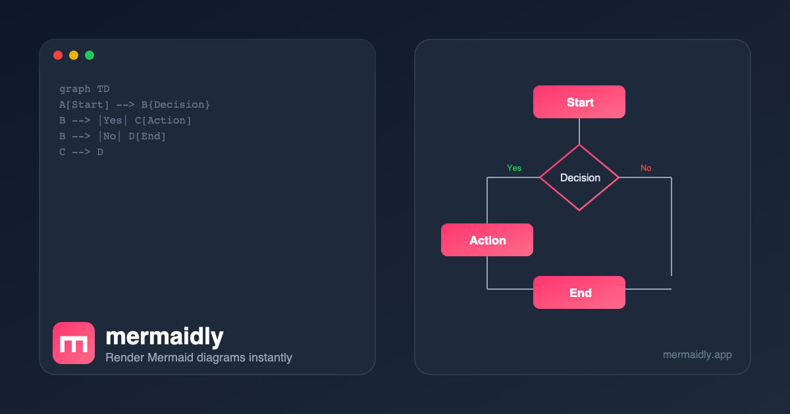

<p align="center">
  <a href="https://mermaidly.app">
    
  </a>
</p>

<h3 align="center">mermaidly</h3>

<p align="center">
  Paste Mermaid code, see diagrams instantly.<br />
  <a href="https://mermaidly.app"><strong>mermaidly.app</strong></a>
</p>

<p align="center">
  <a href="https://github.com/earthpyy/mermaidly/blob/main/LICENSE"></a>
  <a href="https://github.com/earthpyy/mermaidly/stargazers"></a>
  
  
</p>

<br />

<p align="center">
  
</p>

---

## Features

- **Instant rendering** — diagrams update as you type, no button to click
- **All Mermaid diagram types** — flowchart, sequence, class, state, ER, Gantt, pie, mindmap, and more
- **Export** — download as PNG, PNG @2x, SVG, or copy SVG code to clipboard
- **Share** — generate a URL with your diagram encoded in it, or a view-only link
- **Dark mode** — automatic system detection with manual toggle
- **Keyboard shortcuts** — `Ctrl/Cmd+S` to save, `Ctrl/Cmd+Shift+C` to share
- **Zoom controls** — pan, zoom in/out, fit to screen, editable zoom level
- **Example gallery** — preloaded examples for quick starts
- **No backend** — everything runs in your browser, nothing is sent to a server

## Getting Started

### Prerequisites

- [Node.js](https://nodejs.org/) 18+
- [pnpm](https://pnpm.io/) 9+

### Development

```bash
# Clone the repository
git clone https://github.com/earthpyy/mermaidly.git
cd mermaidly

# Install dependencies
pnpm install

# Start the dev server
pnpm dev
```

Open [http://localhost:5173](http://localhost:5173) to see the app.

### Build

```bash
pnpm build
```

### Format

```bash
pnpm format
```

## Tech Stack

| Layer     | Technology                                            |
| --------- | ----------------------------------------------------- |
| Framework | [Vue 3.5](https://vuejs.org/) + TypeScript            |
| Rendering | [Mermaid.js 11](https://mermaid.js.org/)              |
| Styling   | [Tailwind CSS 4](https://tailwindcss.com/)            |
| Build     | [Vite 6](https://vite.dev/)                           |
| Hosting   | [Cloudflare Workers](https://workers.cloudflare.com/) |

## Contributing

Contributions are welcome! Feel free to open an issue or submit a pull request.

1. Fork the repository
2. Create your branch (`git checkout -b feature/amazing-feature`)
3. Commit your changes
4. Push to the branch (`git push origin feature/amazing-feature`)
5. Open a Pull Request

## License

This project is licensed under the [GPL-3.0 License](LICENSE).

---

<p align="center">
  Made by <a href="https://github.com/earthpyy">@earthpyy</a>
</p>
